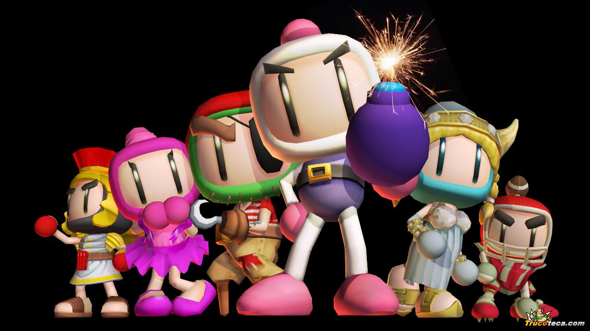

# bomberplan

# Rules
Игрок управляет персонажем в виде человека на прямоугольном уровне, содержащем неразрушаемые и разрушаемые кирпичные блоки. По уровню перемещаются разные враги.
Одни из них имеют возможность проходить сквозь кирпичные блоки, другие передвигаются быстрее игрового персонажа. Игровой персонаж может класть бомбы, взрывающиеся через несколько секунд. При уничтожении кирпичных блоков на их месте могут возникнуть различные бонусы или проход на следующий уровень. Персонаж погибает при соприкосновении с врагом или от взрыва бомбы. Цель игры — уничтожить всех врагов и пройти на следующий уровень.